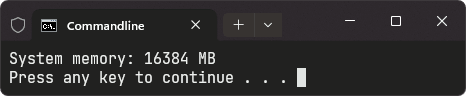
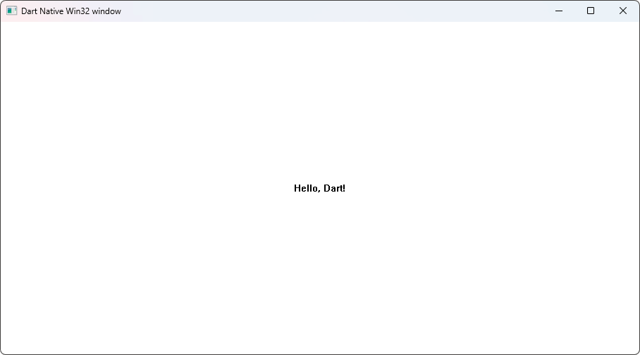

## Introduction

As Dart expands its reach beyond web and mobile development, interacting with
native Windows APIs unlocks a world of possibilities. The **win32** package
serves as a bridge to the powerful features of the Windows operating system,
allowing Dart developers to harness these capabilities directly in their
applications.

In this blog post, we'll explore how to use the **win32** package to call
Windows APIs in Dart, enabling you to create powerful Windows applications with
ease.

<!--truncate-->

Here's what we'll cover:

- [What is win32?](#what-is-win32)
- [Key Features](#key-features)
- [Getting Started](#getting-started)
- [Interacting with Windows APIs](#interacting-with-windows-apis)
  - [Displaying a Message Box](#displaying-a-message-box)
  - [Retrieving the System Memory](#retrieving-the-system-memory)
  - [Creating a Classic Win32 Window](#creating-a-classic-win32-window)
- [Conclusion](#conclusion)

## What is win32?

**win32** is a [Dart package] that wraps some of the most common [Win32 API]
calls using [FFI] to make them accessible to Dart code without needing a C
compiler or the Windows SDK.

The package simplifies the process of writing Dart code that can access
**Windows hardware** and **system services** by providing easy-to-use bindings
for traditional **Win32** and [COM (Component Object Model)][COM] API calls.

Whether you're looking to interact with hardware, access system services, or
build sophisticated desktop applications, **win32** has you covered.

### Key Features

- **Direct Windows API Access**: Invoke Windows API functions directly from Dart
  without the need for a C compiler or additional setup.
- **COM Support**: Easily interact with COM libraries and components for
  advanced Windows functionalities.
- **Extensive API Coverage**: Access a broad range of Windows APIs, including
  system services, hardware, and registry.
- **Seamless Integration**: Effortlessly integrate with existing Windows
  libraries and services, enabling smooth interoperability.
- **Cross-Platform Development**: Develop cross-platform packages with specific
  implementations tailored for Windows environments.
- **Developer-Friendly**: Simplifies the complexity of Win32 API calls into
  easy-to-use Dart functions, enhancing developer productivity.

## Getting Started

Let's dive into how you can get started with the **win32** package and see it in
action.

Add the **ffi** and **win32** packages to your project with:

```sh title="Terminal"
dart pub add ffi win32
```

## Interacting with Windows APIs

Let's explore how you can interact with thee Windows APIs using the **win32**
package.

### Displaying a Message Box

Let's start with a simple example that displays a message box using the
[MessageBox] function from the Windows API.

```dart title="main.dart"
import 'package:ffi/ffi.dart';
import 'package:win32/win32.dart';

void main() {
  final lpCaption = 'Dart MessageBox Demo'.toNativeUtf16();
  final lpText = '''
This is not really an error, but we are pretending for the sake of this demo.

Resource error.
Do you want to try again?
'''
      .toNativeUtf16();

  final result = MessageBox(
    NULL,
    lpText,
    lpCaption,
    MESSAGEBOX_STYLE.MB_ICONWARNING | // Warning icon
        MESSAGEBOX_STYLE.MB_CANCELTRYCONTINUE | // Action button
        MESSAGEBOX_STYLE.MB_DEFBUTTON2, // Second button is the default
  );

  free(lpText);
  free(lpCaption);

  switch (result) {
    case MESSAGEBOX_RESULT.IDCANCEL:
      print('Cancel pressed');
    case MESSAGEBOX_RESULT.IDTRYAGAIN:
      print('Try Again pressed');
    case MESSAGEBOX_RESULT.IDCONTINUE:
      print('Continue pressed');
  }
}
```


### Retrieving the System Memory

Next, let's retrieve the total amount of physical memory installed on the
system using the [GetPhysicallyInstalledSystemMemory] function.

```dart title="main.dart"
import 'dart:ffi';

import 'package:ffi/ffi.dart';
import 'package:win32/win32.dart';

void main() {
  final memoryInKB = calloc<ULONGLONG>();

  try {
    final result = GetPhysicallyInstalledSystemMemory(memoryInKB);
    if (result != 0) {
      final memoryInMB = memoryInKB.value ~/ 1024;
      print('System memory: $memoryInMB MB');
    } else {
      print('Failed to retrieve system memory.');
    }
  } finally {
    free(memoryInKB);
  }
}
```



### Creating a Classic Win32 Window

Finally, let's create a classic Win32 window. First, we'll define the window
procedure that will handle messages sent to the window.

```dart title="main.dart"
import 'dart:ffi';

import 'package:ffi/ffi.dart';
import 'package:win32/win32.dart';

int mainWindowProc(int hWnd, int uMsg, int wParam, int lParam) {
  switch (uMsg) {
    case WM_DESTROY:
      PostQuitMessage(0);
      return 0;

    case WM_PAINT:
      final ps = calloc<PAINTSTRUCT>();
      final hdc = BeginPaint(hWnd, ps);
      final rect = calloc<RECT>();
      final msg = 'Hello, Dart!'.toNativeUtf16();

      GetClientRect(hWnd, rect);
      DrawText(
        hdc,
        msg,
        -1,
        rect,
        DRAW_TEXT_FORMAT.DT_CENTER |
            DRAW_TEXT_FORMAT.DT_VCENTER |
            DRAW_TEXT_FORMAT.DT_SINGLELINE,
      );
      EndPaint(hWnd, ps);

      // Clean up
      free(ps);
      free(rect);
      free(msg);

      return 0;
  }

  return DefWindowProc(hWnd, uMsg, wParam, lParam);
}
```

Next, we'll define the `winMain` entry point, which creates the window and runs
the message loop.

```dart title="main.dart"
// ...

void winMain(int hInstance, List<String> args, int nShowCmd) {
  final className = 'Sample Window Class'.toNativeUtf16();

  final lpfnWndProc = NativeCallable<WNDPROC>.isolateLocal(
    mainWindowProc,
    exceptionalReturn: 0,
  );

  final wc = calloc<WNDCLASS>();
  wc.ref
    ..style = WNDCLASS_STYLES.CS_HREDRAW | WNDCLASS_STYLES.CS_VREDRAW
    ..lpfnWndProc = lpfnWndProc.nativeFunction
    ..hInstance = hInstance
    ..lpszClassName = className
    ..hCursor = LoadCursor(NULL, IDC_ARROW)
    ..hbrBackground = GetStockObject(GET_STOCK_OBJECT_FLAGS.WHITE_BRUSH);
  RegisterClass(wc);

  // Create the window.
  final windowCaption = 'Dart Native Win32 window'.toNativeUtf16();
  final hWnd = CreateWindowEx(
    0, // Optional window styles.
    className, // Window class
    windowCaption, // Window caption
    WINDOW_STYLE.WS_OVERLAPPEDWINDOW, // Window style
    // Size and position
    CW_USEDEFAULT,
    CW_USEDEFAULT,
    CW_USEDEFAULT,
    CW_USEDEFAULT,
    NULL, // Parent window
    NULL, // Menu
    hInstance, // Instance handle
    nullptr, // Additional application data
  );
  free(windowCaption);
  free(className);

  ShowWindow(hWnd, nShowCmd);
  UpdateWindow(hWnd);

  // Run the message loop.
  final msg = calloc<MSG>();
  while (GetMessage(msg, NULL, 0, 0) != 0) {
    TranslateMessage(msg);
    DispatchMessage(msg);
  }

  // Clean up
  free(msg);
  free(wc);
  lpfnWndProc.close();
}
```

Finally, we'll define the `main` function to initialize the application and call
the `winMain` function. The **win32** package provides the `initApp` helper
function, which sets up the WinMain function with all the necessary information,
including the entry point and command line arguments, simplifying the process
for you.

```dart title="main.dart"
// ...

void main() => initApp(winMain);
```



## Conclusion

The **win32** package is a powerful tool for Dart developers aiming to leverage
the full capabilities of the Windows operating system. By bridging the gap
between Dart and the extensive Windows APIs, **win32** enables you to create
feature-rich applications with ease.

Whether you're displaying simple message boxes, querying system information, or
creating complex graphical interfaces, the **win32** package unlocks new
possibilities for your Dart projects. Start exploring today and discover what
you can build with Dart and Windows APIs!

For more detailed information, check out our [documentation](/docs).

[COM]: https://learn.microsoft.com/en-us/windows/win32/com/component-object-model--com--portal
[Dart package]: https://pub.dev/packages/win32
[FFI]: https://dart.dev/guides/libraries/c-interop
[GetPhysicallyInstalledSystemMemory]: https://docs.microsoft.com/windows/win32/api/sysinfoapi/nf-sysinfoapi-getphysicallyinstalledsystemmemory
[MessageBox]: https://learn.microsoft.com/windows/win32/api/winuser/nf-winuser-messagebox
[Win32 API]: https://learn.microsoft.com/windows/win32/api/
